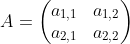
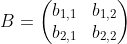
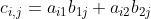

# 1. 알고리즘 : 효울, 분석, 차수
## 들어가면서
알고리즘은 기법에 따라서 문제를 푸는 독특한 단계별 절차가 있다.  
"기법"이란 프로그램을 작성하는 언어나 스타일이 아니라 **문제의 해답을 찾는 해결법**이나 **방법론**을 뜻한다.  
문제를 푸는 기법은 다양하지만, 기법에 따라서 알고리즘의 성능은 차이가 날 수 있다.  
어떤 문제를 어떤 기법으로 풀 것인지, 만든 알고리즘이 시간(time)과 공간(space)의 사용량을 기준으로 얼마나 효율적인지 분석해야 한다.  
여기서 시간은 알고리즘을 컴퓨터로 실행할 때 걸리는 시간을, 공간은 필요한 메모리의 크기를 의미한다.  

## 1.1 알고리즘
이 책은 프로그램 전체 설계보다 특정 과제를 수행하는 개별 모듈(module)의 설계에 중점을 둔다.  
특정 과제는 **"문제(Problem)"**라고 한다. 즉, 문제는 해답을 찾으려고 물어보는 질문이다.  

### 예제1.1  
  ```
  n개의 수로 구성된 리스트 S를 비내림차순(nondecreasing order)으로 정렬(sort)하시오. 해답은 S를 비내림차순으로 정렬한 리스트이다.  
  ```

**리스트(list)**란 어떤 원소를 특정 순서로 나열해 놓은 것이다.  
위의 예제에서 오름차순(increasing order)라고 하지 않고 비내림차순이라 한 이유는 리스트에 같은 수가 한 번 이상 나오는 경우도 허용한다는 뜻이다.  

### 예제 1.2  
  ``` 
  어떤 수 x가 n개의 수의 리스트 S에 있는지 알아보시오. 해답은 만약 x가 S에 있으면 "예"이고, 그렇지 않으면 "아니오"이다.  
  ```  
문제에서 값이 지정되어있지 않은 변수를 그 변수의 **파라미터(parameter)**라고 한다.  
파라미터에 지정할 값을 문제의 **입력사례(instance)**라고 한다.  
즉, 특정 입력사례에 대한 **해답(solution)**이란 그 파라미터를 입력사례로 지정하여 질문한 문제의 해답이다.  

### 예제 1.3  
  ``` 
  예제 1.1에 다음의 입력사례를 지정하면, 
	  S = [10,7,11,5,13,8], n = 6
	이 입력사례에 대한 해답은 [5,7,8,10,11,13]이다.
  ```  

### 예제 1.4  
  ```
  예제 1.2에 다음의 입력사례를 지정하면,
    S = [10,7,11,5,13,8], n = 6, x=5
  이 입력사례에 대한 해답은 "예"이다.
  ```  
어떤 입력사례까 주어지더라도 해답을 찾아주는 프로그램을 작성하기 위해서는 모든 인수에 대해서 해답을 찾아주는 일반적인 단계적 절차를 명시해야 한다. 이러한 단계적 절차가 바로 **알고리즘(algorithm)**이고, "문제는 알고리즘으로 **푼다(solve)**"라고 한다.

### 예제1.5  
  ```
  예제 1.2의 문제를 푸는 알고리즘은 다음과 같다. S의 첫째 원소에서 시작하여 x를 찾을 때까지(x가 없는경우 끝까지) 각 원소를 차례로 x와 비교한다. 
  만약 x를 찾으면 "예"라고 답하고, x를 찾지 못하면 "아니오"라고 대답한다.
  ```

### 알고리즘 1.1  순차검색  
- 문제 : 원소가 n개인 배열 S에 원소 x가 있는가?  
- 입력(파라미터) : 정수 n(x>0), 배열 S(인덱스 범위는 1부터 n까지), 원소 x  
- 출력 : 원소 x가 위치한 인덱스를 location에 저장 (S 안에 x가 없으면 0을 저장)  
  
  ```
  void seqsearch(int n, const keytype S[], keytype x, index& location){
    location = 1;
    while(location <= n && S[location] !=x)
      location++:
      if(location > n)
        location = 0;
    }
    ```

### 알고리즘 1.2 배열의 수 더하기  
- 문제 : 수가 n개인 배열 S에 있는 수를 모두 더하시오  
- 입력 : 정수 n(>0), 수의 배열 S(인덱스의 범위는 1부터 n까지)  
- 출력 : S에 있는 모든 수의 합  

  ```
  number sum (int n, const number S[]){
    index i;
    number result;
    result - 0;
    for(i = 1; i <= n; i++)
      result = result + S[i];
    return result;
  }
  ```

### 알고리즘 1.3 교환 정렬(Exchange Sort)  
- 문제 : 비내림차순(nondecreasing order)으로 n개의 키를 정렬하시오.  
- 입력 : 자연수 n(>0), 키의 배열 S(인덱스의 범위는 1부터 n까지)  
- 출력 : 키가 비내림차순으로 정렬된 배열 S  

  ```
  void exchange (int n, keytype S[]){
    index i,j;
    for(i = 1;i <= n-1; i++)
      for(j = i+1;j<=n;j++)
        if(S[j] < S[i])
          exchange S[i] and S[j];
  }
  ```

### 알고리즘 1.4 행렬 곱셈  
- 문제 : 두 nxn 행렬의 곱을 구하시오.  
- 입력 : 정수 n(>0), 수의 2차원 배열 A와 B. 여기서 이 행렬의 행과 열은 모두 1부터 n까지 인덱스를 붙인다.  
- 출력 : A와 B 행렬의 곱이 표현된 2차원 배열 C. 여기서 이 행렬의 행과 열은 모두 1부터 n까지 인덱스를 붙인다.  

  ```
  void matrixmult (int n, const number A[][], const number B[][], const number C[][]){
    index i , j, k;
    for(i =1;i<=n;i++){
      for( j = 1; j<=n;j++){
        C[i][j]=0;
        for(k=1;k<=n;k++){
          C[i][j] = C[i][j] + A[i][k] * B[k][j];
      }
  }
  ```

다음과 같은 두 개의 2x2 행렬이 있을 때  
와  
그 곱(product)  C = A X B 는 다음과 같이 계산한다.  


일반적으로 2개의 $n \times n$ 행렬 A와 B가 있으면, 그 곱 C는 다음과 같이 구한다.  
 $1 \leq i, j \leq n인 모든 i, j에 대해서 c_{i,j} = \sum_{k = 1}^n a_{ik}b{ki}$
